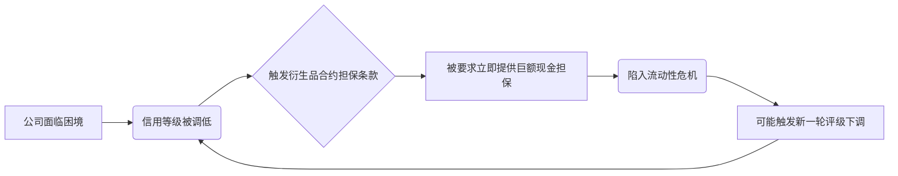

## A.三类投资资产

### 一、 投资资产的三大类别概览

理解各类投资的内在属性是成功投资的基石。总体而言，投资可分为以下三类，每一类都具有截然不同的风险收益特征。

| 类别                       | 核心描述                                             | 关键风险/特征                                                | 巴菲特的态度                                     |
| :------------------------- | :--------------------------------------------------- | :----------------------------------------------------------- | :----------------------------------------------- |
| **第一类：基于货币的投资** | 以特定货币标明的资产，如货币基金、债券、银行存款等。 | ⚠️ **高风险**：表面上安全，实则长期受通货膨胀严重侵蚀购买力。 | **不喜好**，除非作为流动性储备或有异常回报机会。 |
| **第二类：无产出的资产**   | 本身不产生任何价值的资产，如黄金。                   | ⚠️ **投机驱动**：依赖“接盘侠”心态，价格靠恐惧和贪婪支撑，无自我繁殖能力。 | **不看好**，认为远逊于生产性资产。               |
| **第三类：可生产性资产**   | 能持续产出产品或服务的资产，如公司、农场、房地产。   | 💡 **最为安全**：能在通胀时期保持购买力，并在长期提供遥遥领先的回报。 | **最看好的投资之选**。                           |

### 二、 第一类投资：基于货币的资产——“无回报的风险”

此类资产常被视作“安全港”，但历史数据揭示了一个截然相反的真相。

#### 2.1 通货膨胀：看不见的“税”

尽管投资者能按时收回本息，但货币购买力的持续下降构成了巨大风险。

- **美元贬值实例**：自1965年至2011年的47年间，美元累计贬值高达**86%**。这意味着，当年1美元的商品，如今需要超过7美元。
- **购买力测算**：一个免税机构需在此期间实现**年化4.3%** 的债券收益率，方能维持购买力不变。
- **纳税投资者的困境**：
  - 同期滚动投资美国国债的**年化名义回报率为5.7%**。
  - **残酷真相**：对于平均所得税率25%的投资者，5.7%的名义收益在扣除税费和通胀后，**真实收益为零**。
  - **收益侵蚀分解**：
    - 所得税（可见）：拿走约1.4个百分点。
    - 通货膨胀税（无形）：拿走约4.3个百分点，**其侵蚀效应是所得税的三倍多**。

#### 2.2 伯克希尔的实践策略

尽管不看好此类资产，但伯克希尔基于战略需要依然持有大量头寸，尤其是短期品种。

- **流动性要求**：
  - **首要任务**：保持充足的流动性，此为**重中之重**。
  - **绝对底线**：100亿美元。
  - **常规需求**：200亿美元。
  - **工具选择**：主要持有**美国国债**，因其在极端环境下仍是唯一可靠的流动性工具。
- **投资例外**：仅在出现**异乎寻常的回报**时才会额外配置，例如：
  - 特殊事件导致的错误定价（如垃圾债周期性崩溃）。
  - 高利率环境下，获取利率下行时的显著资本利得。

> ⚠️ **警示**：正如华尔街人士谢尔比·库洛姆·戴维斯所言：“债券在被推销时，说是可以提供无风险的回报，现在的定价却只剩下**无回报的风险**。”

### 三、 第二类投资：永不产出的资产——“接盘侠游戏”

这类资产的投资逻辑完全建立在“总有更傻的人”这一假定之上，其价值仅源于买家的持续扩大，而非自身产出的任何价值。

#### 3.1 黄金的硬伤

黄金是该类资产的典型代表，存在两大根本性缺陷：

1.  **用途有限**：工业和装饰需求均很有限，无法吸收新的巨大产能。
2.  **无法自我繁殖**：你永远只能拥有你持有的那一盎司，不会有任何数量的增长。
3.  **投机本质**：买家动机往往是赌“恐惧程度升高会推升价格”，价格上涨本身又成为自我实现、吸引新买家的“验证”，形成泡沫。

#### 3.2 9.6万亿美元的思考实验

将全球存量黄金（约17万公吨）塑成一个**边长68英尺的金色立方体（A）**，其当前价值为**9.6万亿美元**。

|                  | **立方体A：黄金**                                    | **立方体B：生产性资产组合**                                  |
| :--------------- | :--------------------------------------------------- | :----------------------------------------------------------- |
| **资产构成**     | 全球17万公吨存量黄金。                               | - 美国全部4亿英亩农田（年产值约2000亿美元）。 - 16个埃克森-美孚石油公司（全球最赚钱公司，年盈利超400亿美元）。 - 外加约1万亿美元现金剩余。 |
| **100年后**      | 体积不变，依然无任何产出。可以抚摸它，但它毫无反应。 | 农田将持续产出数量惊人的谷物；石油公司将派发上万亿美元分红，并持有超万亿美元的资产。 |
| **长期回报判断** | **远远低于**B类。                                    | **遥遥领先**。                                               |

> 💡 **结论**：对于货币崩溃的恐惧，驱动人们冲向黄金；而对于经济崩溃的恐惧，则驱动人们持有现金（如国债）。这两种行为，在恐惧顶峰时往往都是代价沉重的随大流之举。当2008年人人高呼“**现金为王**”时，恰是应动用现金之时。

### 四、 第三类投资：可生产性资产——“安全与回报的终极之选”

这是巴菲特最为看好的资产类别，其内在价值源于持续的生产能力，而非交易媒介的形式。

#### 4.1 核心优势与筛选标准

最理想的资产，即便在通胀环境下，也仅需极少的新资本再投入，便能维持其购买力价值的产出。

**双重标准测试（通过案例）：**

- **农场与房地产**
- **优质公司**：如**可口可乐**、**IBM**、**禧诗糖果**等。

**未完全符合标准但仍优于前两类（案例）：**

- **受管制的公用事业公司**：通胀会带来沉重的资本负担，盈利增长需要更多资本投入。

#### 4.2 投资的本质比喻

- **商业“奶牛”**：我们国家的企业就像一头头会存活上百年的奶牛，持续产出更多“牛奶”。
- **价值的根源**：它们的价值不取决于交换媒介（黄金、贝壳、纸钞），而取决于其**产奶能力**。
- **复利的体现**：来自“牛奶”的收入将带来复利增长，正如20世纪的道琼斯指数，从66点上涨至11497点，期间还伴随持续分红。

#### 4.3 伯克希尔的战略

- **首要选择**：整体收购，持有优秀企业100%的股权。
- **其次选择**：通过在二级市场买入流通股，持有部分优秀公司的股权。
- **最终信念**：在任何较长的时间段内，这类投资都将被证明是**遥遥领先的优胜者，也是迄今为止最为安全的投资**。

## B.垃圾债券

### 一、 股票投资 vs. 垃圾债券投资

两类投资均要求进行**价格与价值的计算**，并从大量对象中筛选出少数风险回报比具有吸引力的目标。但其核心逻辑与风险特征存在重大区别。

| 对比维度     | 股票投资                                       | 垃圾债券投资                                 |
| :----------- | :--------------------------------------------- | :------------------------------------------- |
| **投资对象** | 财务稳健、具有强大竞争力、德才兼备管理层的公司 | 处于边缘地带、负债高企、资本回报率低下的企业 |
| **管理层**   | 品质可靠，利益与股东一致                       | 品质存疑，利益可能与债权人相悖               |
| **投资预期** | 亏损是罕见的（伯克希尔历史盈亏比约100:1）      | 预料到会偶尔出现大的损失                     |
| **核心策略** | 以合理价格买入优质公司                         | 在混乱中寻找被错误定价的机会                 |

> 我们始终秉持近乎“嗜睡症”般的懒散投资风格，专注于长期持有优质资产。

### 二、 银行股的投资逻辑：以富国银行为例

银行业并非我们的偏好。其 **20倍于权益的高杠杆**特性，使得即便是微小的资产配置错误，也可能吞噬大部分净资产，并将管理层的优缺点放大。

#### 2.1 投资标准

我们对投资银行有清晰的标准：

-   ❌ **不受欢迎的行为**：以“便宜”的价格购买一家糟糕的银行。
-   ✅ **理想的行为**：**以合理的价格购买管理优良的银行**。

#### 2.2 杰出管理层的特质

富国银行的卡尔·赖卡特和保罗·哈森与大都会的汤姆·墨菲和丹·伯克类似，体现了卓越管理团队的品质。

-   **协同效应**：搭档间相互了解、信任、尊重，合力大于简单相加。
-   **高效管理**：能为能干的人支付高薪，但厌恶冗员。
-   **成本控制**：无论经营顺逆，都积极控制成本。
-   **理性决策**：坚守能力圈，理性决策，而非感情用事。

#### 2.3 1990年投资富国银行的逻辑

我们利用市场对银行股的恐慌，以 **2.9亿美元** 购入了富国银行 **10%** 的股份。

-   **估值**：购买价格低于税后盈利的5倍，低于税前盈利的3倍。
-   **盈利能力**：净资产回报率超过20%，总资产回报率为1.25%。
-   **机会成本**：这相当于以极低折扣购买了一家资产50亿美元、拥有顶级管理层的优质银行。

#### 2.4 风险评估与应对

尽管投资银行风险重重，但我们进行了审慎的评估。

| 风险类型         | 具体描述                                               | 评估与应对                                                   |
| :--------------- | :----------------------------------------------------- | :----------------------------------------------------------- |
| **特殊风险**     | 加州发生强烈地震，可能导致大规模贷款违约。             | 前两种风险发生的概率较低；我们认为，房地产价值一定幅度的下跌，不太可能引发管理优良的银行出现重大问题。 |
| **系统性风险**   | 业务收缩或金融恐慌会危及所有高负债机构。               |                                                              |
| **市场主要担忧** | 西海岸房地产供给过剩导致房价暴跌，引发银行业巨大损失。 | 我们做了压力测试：即使1991年贷款总额的10%出问题（将损失30%资本金），富国银行依然能**勉强维持盈亏平衡**。这种惨烈情况发生概率低。 |

> 💡 **投资智慧**：股价下跌对我们有利，它让我们有机会以更恐慌的价格买入。**导致股价低迷的悲观主义，才是我们作为理性买家的朋友；乐观主义是我们的敌人。** 我们的行动需要独立思考，而非人云亦云。

### 三、 “堕落天使”与垃圾债券的警示

#### 3.1 两类债券的本质区别

我们偶尔投资低于投资等级的债券，但仅限于“**堕落天使**”（即原本为投资级后被降级的债券），而非新发行的垃圾债券。两者存在天壤之别。

| 对比维度       | “堕落天使”债券               | 新发行垃圾债券                         |
| :------------- | :--------------------------- | :------------------------------------- |
| **管理层目标** | 设法使债券恢复“投资等级”     | 像“吸毒者”一样寻求下一次融资以缓解危机 |
| **管理层责任** | 信托责任感相对成熟           | 信托责任感通常较差                     |
| **投资逻辑**   | 基于企业基本面改善的困境反转 | 基于统计模型的多元化投机               |

#### 3.2 垃圾债券市场的谬误与风险

20世纪80年代的垃圾债券浪潮是一场灾难。推销者用看似精妙的金融理论包装巨大的风险，其核心谬误在于：

-   **错误的历史统计**：用老派“堕落天使”的违约率，来预测新发行垃圾债券的未来。这好比在“琼斯镇惨案”发生前，用历史死亡率来证明“酷爱”饮料的安全性。
-   **危险的“匕首理论”**：声称巨大负债能让管理层更专注。这如同在方向盘上装匕首，一次微小坑洞就足以致命，而商场遍布坑洞。
-   **华尔街的利益驱动**：华尔街推销一个主意的热情，不取决于优点，而取决于带来的利益。

> ⚠️ **根本原则**：本杰明·格雷厄姆的“**安全边际**”原则是投资的基石。忽略它，让许多投资者在20世纪90年代初期蒙受了重大损失。

### 四、 核心投资哲学总结

我们在RJR Nabisco债券等机会上的探索表明，我们会留意任何能理解、且价格与价值差距巨大的投资。这一过程中的成功，源于对以下原则的坚守：

-   **独立思考**：“大多数人宁愿去死，也不愿意思考。”我们需要摒弃从众心理。
-   **警惕理论模型**：不要被“有效市场理论”和“现代投资组合理论”等模型洗脑，而忽视了风险警示，这是典型的“专家”型错误。广泛多元化购买垃圾债券反而导致了凄惨的结果。
-   **坚守安全边际**：这是我们应对不确定性的唯一屏障。

## C.零息债券

#### 一、零息债券基础：伯克希尔的案例与机制

##### 1.1 伯克希尔零息可转换债券发行概况

伯克希尔·哈撒韦公司发行的零息可转换次级债券，为我们理解此类金融工具提供了一个清晰的范本。该债券由所罗门兄弟公司承销，其关键特性如下表所示：

| 特性             | 详情                                          |
| :--------------- | :-------------------------------------------- |
| **发行总额**     | 9.026亿美元                                   |
| **发行期限**     | 15年                                          |
| **发行价格**     | 面值的44.314%                                 |
| **有效复合利率** | 5.5%（每半年复利）                            |
| **实际募集现金** | 约4亿美元（已扣除950万美元发行费用）          |
| **转换条款**     | 每1万美元面值债券可转换为0.4515股伯克希尔股票 |
| **转换溢价**     | 转换价格约为9815美元/股，相对当时市价溢价15%  |

> 💡 **核心机制**：零息债券不支付定期利息。投资者的回报来源于 **以远低于到期价值（面值）的折扣价买入**，在到期时获得全额偿付，其间的差额即为收益。

##### 1.2 赎回条款与税务效应

- **公司主动性赎回**：伯克希尔有权在1992年9月28日之后，按债券的**孳息后价值**（初始发行价按5.5%年复利累计）进行赎回。
- **投资者选择性回售**：债券持有人可在1994年和1999年的9月28日，要求公司按孳息后价值赎回债券。
- **税务影响的不对称性**：
  - **对发行人（伯克希尔）**：尽管无需支付现金，但每年可计提5.5%的利息作为税务抵扣，产生正向现金流，有效融资成本**远低于5.5%**。
  - **对投资者（债券持有人）**：即使未收到现金，也**必须每年按5.5%的利息收入进行纳税申报**。

#### 二、零息债券的历史渊源与良性应用

##### 2.1 来自政府的先驱：E系列储蓄债券

在二战期间发行的美国**E系列储蓄债券**本质上就是一种零息债券。
- **投资方式**：以18.75美元买入，十年后由政府以25美元兑付。
- **年化回报率**：约2.9%。
- **优势**：利率高于当时的普通政府债券，且持有者可以随时变现，市场波动风险极低。

##### 2.2 金融创新的典范：“息票剥离”国债

为了解决普通附息债券的“再投资风险”，投资银行家发明了将国债本息剥离的技术。

| 债券类型               | 机制                                                         | ⚠️ 核心问题                                                   |
| :--------------------- | :----------------------------------------------------------- | :----------------------------------------------------------- |
| **普通附息债券**       | 定期支付固定利息。                                           | 存在**再投资风险**：为了实现广告宣传的复利回报率，期间收到的利息必须能以同等利率进行再投资。若市场利率下行，则无法实现预期收益。 |
| **“息票剥离”零息债券** | 将国债的未来利息和本金现金流，分离成多张独立、到期日不同的零息债券。 | 完美解决了再投资风险。投资者在购买时，即可锁定整个持有期间的年复合回报率。 |

> **示例**：将一张长期国债剥离后，其半年后到期的息票可能以面值的`95.24%`交易，而20年后到期的息票可能仅以面值的`14.20%`交易。无论哪种期限，都保证了持有期间固定的年复合回报率。

这种创新的工具满足了退休基金等长期投资者的需求，是高评级零息债券的典范。

#### 三、零息债券的滥用

##### 3.1 问题的开端：杠杆收购下的疯狂

随着杠杆收购（LBO）的狂热，企业估值标准不断恶化：

1.  **保守期**：评估基于企业自由现金流是否足以覆盖利息及适度偿还本金。
2.  **疯狂期**：收购价格高企，所有现金流仅够支付利息，本金偿还被无限推迟。
3.  **彻底沦陷期**：游戏变成以新债还旧债，借贷双方心照不宣地忽略最终偿还问题。

##### 3.2 一个令人憎恶的概念：EBDIT

为了将毫无偿付能力的交易包装成可行，华尔街发明了**EBDIT**（扣除折旧、利息和税项之前的盈利）。

- **定义**：用这个最宽松的指标来测试企业偿还利息的能力。
- **荒谬之处**：它将**折旧**这种真实、必要的长期费用视为可忽略项。巴菲特强调，对95%的美国公司而言，折旧和劳动力成本一样，是**必需的资本支出**。

> 💡 巴菲特与芒格对此持批判态度，他们坦言：“我们喜欢那些**无法支付资本支出的竞争对手**。”

##### 3.3 登峰造极的骗局：对累计利息的忽略

金融推销员将此逻辑推向极致：在评估零息或PIK（以债付息）债券的交易时，**连不断累计的利息成本也一并忽略不计**。

- **运作方式**：
  - 对于那些现金利息支出已占盈利80%-90%的公司，通过发行高息零息债券进行再融资。
  - 这些债券的利息不产生当期现金支出，而是复利累积，逐年膨胀。
  - 这为公司短期内创造了虚幻的“盈利空间”。

| 项目                           | 第一年                                | 第二年起                         |
| :----------------------------- | :------------------------------------ | :------------------------------- |
| **税前盈利**                   | 1亿美元                               | 1亿美元                          |
| **需现金支付的利息**           | 9,000万美元                           | 9,000万美元                      |
| **零息债券当年产生的累计利息** | 6,000万美元                           | 超过6,900万美元（复利增长）      |
| **对投资者的宣称**             | EBDIT完全能覆盖现金利息，故交易可行。 | **累积的巨额利息被视为不存在。** |

#### 三、 零息债券的危害与总结

##### 4.1 魔术般的假象与“盗用”类比

- **财富幻觉**：一家年入1亿的公司，通过这种方式，却能在账面上为投资人“创造”出1.5亿的“盈利”，如同肯·加尔布雷思教授笔下的“**盗用**”概念——在被发现前，挪用者变富，而失主并未感到变穷。
- **时间的把戏**：零息债券拉长了从“愚蠢决策”到“最终违约”的时间窗口。推销员得以在这段“蜜月期”内赚取巨额佣金，而投资者却对即将到来的灾难浑然不知。

##### 4.2 关键警示与最终建议

⚠️ **危险的信号**：当听到以下言论或情形时，务必保持警惕：
- 投资银行家开始大谈**EBDIT**。
- 任何新设计的资本结构，其利息无论是当期支付还是累积支付，都明显超出企业的支付能力。
- 用复杂的会计诡计和资本架构，试图将一家平庸公司包装为杰出企业。

> **巴菲特的建议**：
> 1.  **合上钱包**：面对上述推销，立刻终止对话。
> 2.  **检验诚意**：建议推销员及其团队，只有在零息债券被按期足额兑付后，才能获取酬金。观察此举能否让他们热情冷却。

##### 4.3 最后的补注：社会性愚蠢成本

- **投资银行家的角色**：应扮演资本市场“看门人”，而非为了佣金与推销员共谋，将烂醉的投资者送上高速公路。近年来这一道德约束已严重缺失。
- **储贷社的悲剧**：许多储贷社曾是这类债券的大买家，利用联邦存款保险的资金，为虚增利润而购入高息零息债券。当这些贷款最终无法收回时，**成本最终由纳税人承担**。

尽管零息债券本身并非邪恶，巴菲特本人也持有部分此类债券，但其各种带有欺骗性的“恶作剧变种”危害潜力巨大。归根结底，**金融上的炼金术终将失败**。推销员和轻信的投资者可能一度富有，但这并非源于企业的真实成就。

## D.优先股

### 一、优先股投资理念

#### 1.1 合作伙伴的选择标准

伯克希尔只与**喜欢的、尊敬的、信任的**人打交道。以下管理者均达到了这一标准：

| 公司       | 管理者                                | 职位 |
| :--------- | :------------------------------------ | :--- |
| 所罗门证券 | 约翰·古特弗罗因德 (John Gutfreund)    | 高管 |
| 吉列公司   | 小科尔曼·莫克勒 (Colman Mockler, Jr.) | 高管 |
| 美国航空   | 艾德·科洛德尼 (Ed Colodny)            | CEO  |
| 冠军公司   | 安迪·西格勒 (Andy Sigler)             | 高管 |

#### 1.2 优先股的核心条款

> 💡 **关键安排**：在每一个优先股投资案例中，被投资公司都会给予伯克希尔**无限制的、具有完全转换基础上的投票权**。这种安排在公司通常的融资结构中并不多见。

这体现了双方的相互信任：
- **被投资方**相信伯克希尔是明智的股东，着眼未来而非眼前
- **伯克希尔**相信对方是明智的经理人，着眼未来也顾及当下

#### 1.3 投资回报逻辑

**回报来源的双重性**：

1. **固定收益特征**：优先股提供"平常的回报"（分红）
2. **转换增值潜力**：被投资公司普通股的良好表现带来超额回报

> ⚠️ **核心原则**：伯克希尔从自己持有的四只优先股中取得满意回报的唯一途径是，**让这些被投资公司的普通股有良好的表现**。

**对优先股投资的定位**：

- 作为一组股票，其回报可能不如"具有良好经济前景且被市场低估的公司"
- 也可能不如"购买具有优秀管理层的优秀企业80%或更多股权"
- 但是这两类机会都非常稀少，尤其是考虑到伯克希尔目前以及未来预期的财力规模

#### 1.4 伯克希尔扮演的角色

伯克希尔在被投资公司中扮演**虽然不太重要，但富有乐趣的、建设性的角色**：

- 给予积极支持、冷静分析以及客观公正的建议
- 与被投资公司的CEO们交流，他们对自己所处行业富有经验且非常在行
- 在特定时候，帮助CEO们测试与本行业无关或与过去决策无关的思维方式或能力

### 二、我们犯过的错：美国航空优先股投资

#### 2.1 错误概览

> ⚠️ **错误往往在决策的时候发生**。如果决策愚蠢到了显而易见的程度，我们只能颁发自己"今日头条错误大奖"。

**1994年"错误大奖"争夺情况**：

| 奖项       | 错误描述                                                     | 损失/后果                           |
| :--------- | :----------------------------------------------------------- | :---------------------------------- |
| 🥈 银牌     | 1993年下半年以63美元/股卖掉1000万股大都会公司股票，到1994年底涨至85.50美元 | 差价2.225亿美元                     |
| 🥇 **金牌** | 1989年花3.58亿美元购买美国航空优先股，1994年9月停止支付分红  | 投资减值75%，账面价值降至8950万美元 |

#### 2.2 美国航空投资错误的根源

##### 2.2.1 根本性误判

> ⚠️ **致命疏忽**：在买入美国航空之前，我完全没有关注到一家运输公司会面临的**无可避免的困扰——成本高企，而且极难降低**。

**历史背景分析**：

| 时期         | 行业状况                                                 | 成本转嫁能力                         |
| :----------- | :------------------------------------------------------- | :----------------------------------- |
| 价格管制年代 | 航空公司受到保护免于竞争，机票价格高                     | 可以通过高票价转嫁高昂成本           |
| 管制取消初期 | 低成本运输公司运力太小，高成本航线维持票价结构           | 大部分长期问题未显现，但开始转移扩散 |
| 低成本扩张期 | 低成本航空运力扩大，低票价策略迫使守旧高成本航空公司降价 | **不可能维持的成本使运营举步维艰**   |

##### 2.2.2 经济规律的忽视

> ⚠️ **重要真理**：在一个没有价格管制的普通商品型生意中，一家公司必须将成本降低到具有竞争力的水平，否则就会灭亡。

**美国航空的成本困境**：

- CEO塞斯·斯科菲尔德 (Seth Schofield) 一直勤勉工作，但时至今日尚未见成效
- 部分原因：不得不对付一个**移动的目标**
  - 一些大型航空公司已获得劳工让步
  - 另一些公司从破产程序中得到了"新建"成本
  - 雇员拿着高于市场水平的合同工资，拒绝任何削减工资的提案

> 💡 **赫布·凯莱赫 (Herb Kelleher，西南航空CEO) 的名言**："破产法院已经成为航空公司的疗养胜地。"

**业绩数据**：

- 1990年到1994年期间，美国航空公司**累计亏损24亿美元**
- 这种业绩几乎将其全部普通股的账面净资产全部抹去

#### 2.3 投资减记的会计处理

| 时间点         | 会计处理                                       | 金额/影响                         |
| :------------- | :--------------------------------------------- | :-------------------------------- |
| 1994年第三季度 | 按估计市值入账，优先股金额记录为成本的25%      | 8950万美元（成本3.58亿美元的25%） |
| 1994年第四季度 | 判定价格下滑为"非临时性"，将减记金额记入损益表 | 减记2.685亿美元                   |

> 💡 **会计要点**：第四季度减记对第四季度**没有影响**，没有减少资产净值，因为价值的减少已经记录在资产负债表上。

#### 2.4 投资基本原则

> ⚠️ **无论结局如何，我们都会留心一条投资基本的原则：你不必以失去它的方式，将它找回来。**

#### 2.5 美国航空的后续发展

**困境中的积极因素**：

1. **"惩罚性分红"条款**：
   - 优先股合同中规定：正常分红率基础上，违约再加5%，可在任何违约欠款上累计
   - 被拖欠两年的复利将在**13.25%～14%**之间
   - 该条款刺激公司尽一切努力尽快支付分红

2. **业绩转机**：
   - 1996年下半年扭亏为盈，重新开始支付分红，给了伯克希尔**4790万美元**
   - 感谢CEO斯蒂芬·沃尔夫 (Stephen Wolf) 从公司运营中挤出支付分红的钱
   - ⚠️ 但成本问题仍未解决，业绩好转很大程度上得益于行业顺风顺水（景气循环）

3. **投资结果**：
   - 优先股价值几乎等同面值3.58亿美元
   - 数年以来累计收到的分红是**2.405亿美元**（包括1997年收到的0.3亿美元）

**两次"幸运"的卖出失败**：
- 1995年曾试图以面值价格卖出50%持股——**没有成功**
- 1996年初再次试图卖掉持股（当时约值3.35亿美元）——**再次没有成功**

> 💡 **巴菲特自嘲**：一位朋友问我："你这么富有，为什么还这么不聪明呢？"在回顾了我在美国航空公司的糟糕表现之后，你们或许能明白他说的有道理。

#### 2.6 美国航空复苏的关键因素

**与公司显著反弹相一致的两个变化**：

| 变化 | 内容                     | 重要性                                                 |
| :--- | :----------------------- | :----------------------------------------------------- |
| ①    | 芒格和巴菲特离开了董事会 | —                                                      |
| ②    | 斯蒂芬·沃尔夫出任CEO     | **关键**——沃尔夫在航空公司业内的贡献成就卓然，有目共睹 |

**复苏成果**：
- 1997年补偿了拖欠的优先股分红，外加额外赔偿
- 普通股价格从低位的**4美元/股**，涨到了近期的高位——**73美元**
- 优先股已在3月15日被赎回，但使用转换权后收益不菲
- 现在几乎可以肯定，持有的美国航空股票会带来**不菲的利润，甚至可以称为暴利**

> 💡 **巴菲特的幽默**：下一次，在我犯下重大愚蠢的错误时，伯克希尔的股东应该知道如何应对——**给沃尔夫先生打电话**。

#### 2.7 航空业的重要真理

> ⚠️ **核心教训**：当一个公司销售的是**普通商品型产品（或服务）**时，它不可能比最为愚蠢的竞争对手聪明多少。

**投资时机反思**：

- 大举投资美国航空的时候，几乎正好是它遭遇严重危机的时候
- 公司的困境一方面来自整个行业状况，另一方面来自与皮德蒙特公司 (Piedmont) 合并后遭遇的困境
- ⚠️ 这个麻烦本该预料到，因为**所有航空公司的合并都会带来运营上的混乱**

### 三、投资优先股的五个案例

#### 3.1 可转换优先股的基本特征

> 💡 **价值来源**：我们持有的优先股的价值来源于它的**固定收入的特征**。这意味着，这些证券的价值不可能比那些不可转换证券的价值低，因为它们带有可转换选择权，它们应该更有价值。

**两种选择权**：
1. **作为固定收益证券**持有
2. **转换为普通股**（选择权在伯克希尔）

**重要区别**：
- 美国运通"Percs"：购买三年后**自动转换**为普通股
- 其他可转换优先股：只在伯克希尔**希望转换的时候**才可以转换

**投资目标**：
- 希望获得税后收益，可以"适度"超过其他中期固定收益证券的所得
- 作为一个整体，这类投资"不会产生超越具有优秀经济前景的回报"
- 几乎在任何情况下，期望这些优先股的投资能**返还本金，外加分红**

#### 3.2 案例一：吉列公司 (Gillette) —— 最佳持股

**投资概况**：

| 项目     | 详情                               |
| :------- | :--------------------------------- |
| 投资时间 | 1989年                             |
| 投资金额 | 6亿美元（优先股）                  |
| 转换结果 | 后转换为4800万普通股（经拆股调整） |
| 当前价值 | 已上升到**48亿美元**               |

**替代方案分析**：
- 原本可以直接购买6000万普通股
- 当时普通股价格约为10.50美元，考虑到大型私募所附带的重要限制性条款，可以至少有**5%的折扣**

**错误反思**：

- 在不到两年的时间里，收到了一些额外的分红（优先股和普通股的收益之差）
- 吉列公司相当正确地赎回了优先股，以尽可能快的速度
- 如果当初买的是普通股，在1995年年底减去"额外"的7000万美元分红之后，会有**6.25亿美元**，情况会更好一些

> 💡 **巴菲特评价**：令人讽刺的是，在吉列身上，我犯了一个最大的错误。然而，这个错误属于**永远不会显现在财务报表上的那种错误**。

#### 3.3 案例二：冠军公司 (Champion) —— 造纸行业

**投资结果**：
- 公司有权在去年8月份以**115%的成本价**赎回优先股
- 伯克希尔希望这个期限能够延迟
- 行使了转换权，在赎回日期之前**全部转换为普通股**，并给予适当折扣

**行业观点**：
- 芒格和巴菲特**从来没有看好过造纸行业**
- 巴菲特不记得在54年的投资生涯中，曾经持有纸业公司的普通股

**退出方式**：
- 8月份选择在市场上卖出该股，或卖回给公司，让公司回购

**收益情况**：
- 冠军公司资本收益率一般，投资六年的税后收益为**19%**
- 持有的优先股在持有期间带来了不错的税后分红收益

> ⚠️ **税务说明**：很多媒体夸大了财险公司收到的分红所得的税后收益率，没有考虑到1987年生效的新税法，大幅减少了保险公司分红所得的实际收益。

#### 3.4 案例三：第一帝国银行 (First Empire) —— 杰出银行家

**投资概况**：

| 项目     | 详情                                |
| :------- | :---------------------------------- |
| 投资时间 | 1991年                              |
| 投资金额 | 0.4亿美元                           |
| 赎回时间 | 1996年3月31日（可以赎回的最早日期） |
| 当前价值 | 已上升到**2.36亿美元**              |

**处理方式**：
- 被赎回后，将优先股转换为普通股，并继续持有
- 拥有一家管理良好的银行令伯克希尔感到轻松自在

**核心人物**：
- CEO鲍勃·威尔默 (Bob Wilmers) —— 一位杰出的银行家
- 伯克希尔喜欢和他一路同行

#### 3.5 案例四：所罗门证券 (Salomon Brothers) —— 表现落后

**投资概况**：
- 1987年买入所罗门的优先股
- 投资金额：7亿美元
- 条款要求：1995年到1999年期间，每年的10月31日由公司赎回发行量的20%

**赎回进度**：
- 到去年，原来持有的7亿美元已经有**1.4亿美元**被赎回
- 在这只可转换的苹果上已经咬了四口

**巴菲特的自嘲**：
> 1987年买入所罗门的优先股不久，我曾经写过"对于投资银行的发展方向或未来的盈利能力，我没有特别的洞察力"。现在，甚至最为仁慈的评论员也可以得出结论，**我已经证实了这一点**。

**管理精力成本**：
- 芒格和巴菲特在这只持股上所花费的管理时间和精力，大大高于它对于伯克希尔的经济重要程度
- 巴菲特从没有想过在60岁的时候从事一个新工作——**出任所罗门证券公司的临时董事长**
- 因为早先买的只是一种固定收益证券

**最终结果**：
- 所罗门证券公司最近合并入了旅行家集团 (Travelers Group)
- 这笔交易对于那些长期忍受折磨的股东而言，终于算是有了一些奖赏
- 所有伯克希尔的股东——包括巴菲特本人在内——都欠所罗门公司的德里克·莫恩 (Deryck Maughan) 和鲍勃·德纳姆 (Bob Denham) 一大笔人情债

**关键贡献**：
1. 在将所罗门公司从1991年的丑闻毁灭边缘拯救过来的过程中，他们扮演了重要角色
2. 将公司的活力恢复到一个具有吸引力的水平，使公司能够达成与旅行家集团的合并

> 💡 **巴菲特的感悟**：在1991年到1992年期间（我出任所罗门公司董事长），我感觉就像戏剧评论家所说的："我本来可以好好欣赏这场表演，不幸的是坐错了座位，它面朝着舞台。"

#### 3.6 案例五：美国运通 (American Express) —— Percs投资

**投资概况**：

| 项目     | 详情                          |
| :------- | :---------------------------- |
| 投资时间 | 1991年                        |
| 投资金额 | 3亿美元                       |
| 证券类型 | 优先权益赎回累计股票（Percs） |
| 转换时间 | 1994年8月转为普通股           |

**Percs特征**：
- 实质上是一种在头三年可以转换的普通股
- 可以在前三年收到额外的分红
- 同期的股价上涨与伯克希尔**无关**（有封顶）
- 尽管有封顶，这项投资被证明还是很赚钱的

**持有决策**：
- 1994年8月转为普通股后，巴菲特反复考虑是否卖出
- 继续持有的原因：美国运通杰出的CEO哈维·戈卢布 (Harvey Golub)，他似乎在尽一切努力将公司潜力最大化

**潜在风险**：
- 美国运通面临着以VISA公司为领导的大量发卡公司的无情竞争
- 在权衡各种因素后，巴菲特倾向于卖出

### 四、我如何成了美国运通的大股东

#### 4.1 从卖家到买家的转变

**关键转折点**：
- 就在做出卖出决定的那个月，巴菲特在缅因州的普洛兹奈克与赫兹 (Hertz) 公司的CEO佛兰克·奥尔森 (Frank Olson) 一起打高尔夫

**信息获取过程**：
1. **第一个发球台开始**：一直询问奥尔森关于信用卡行业的情况
2. **第二个洞的果岭时**：奥尔森让巴菲特意识到，美国运通公司的发卡业务具有**惊人的特许权**
3. **折返回来的第九洞时**：已经从潜在卖家变成了买家

**最终结果**：
- 几个月后，伯克希尔持有了**10%**美国运通的股份
- 现在持有的美国运通已经获利**30亿美元**

> 💡 **感谢链**：巴菲特感谢佛兰克·奥尔森，但共同的朋友乔治·吉莱斯派 (George Gillespie) 说，毕竟是他安排了球赛，并且是他把巴菲特分派到了佛兰克的四人打球小组里。

### 五、核心投资原则总结

#### 5.1 优先股投资原则

| 原则           | 说明                                             |
| :------------- | :----------------------------------------------- |
| **人先于交易** | 只与喜欢、尊敬、信任的人打交道                   |
| **价值双重性** | 优先股价值 = 固定收益价值 + 转换选择权价值       |
| **下行保护**   | 优先股结构应能在几乎任何条件下收回投资本金       |
| **上行参与**   | 满意回报的唯一途径是被投资公司普通股表现良好     |
| **建设性角色** | 作为稳定、有利益关系的股东，提供积极支持而非干预 |

#### 5.2 错误与教训

| 教训                                                 | 来源                     |
| :--------------------------------------------------- | :----------------------- |
| **错误往往在决策时发生**                             | 美国航空、大都会股票卖出 |
| **不要忽视行业结构性成本问题**                       | 美国航空投资失败         |
| **商品型生意中，成本控制决定生死**                   | 航空业分析               |
| **不必以失去它的方式，将它找回来**                   | 美国航空减记决策         |
| **优先股价值来源于固定收入特征**                     | 所罗门等案例的媒体误读   |
| **销售普通商品型产品，不可能比最愚蠢的对手聪明多少** | 航空业竞争分析           |

## E.衍生品

### 一、 核心观点：作为“定时炸弹”的衍生品

对于金融衍生品及其交易活动，巴菲特与芒格持有高度一致的看法：**我们将其视为定时炸弹，无论是对交易的双方，还是对于整个经济体系。**

### 二、 衍生品基础概念解析

衍生品一词覆盖了极为广泛的金融合约，其本质特征如下：

#### 2.1 基本定义与运作机制

| 特性         | 详细说明                                                     |
| :----------- | :----------------------------------------------------------- |
| **定义**     | 要求在**未来某个时点**进行资金换手的工具，换手金额由一个或多个参考指标决定。 |
| **参考指标** | 利率、股价、汇率、指数（如标普500）等。                      |
| **核心特征** | - **无初始现金换手**：合约签订时，通常没有现金易手。 - **损益表记账**：尽管无现金流动，但巨大的盈亏额会记录在双方损益表上。 - **最终履约依赖信誉**：除非有质押担保，合约最终价值取决于签约方的履约能力。 |
| **合约期限** | 长短不一，短则数天，长则可达20年，甚至**100年**。            |
| **种类范围** | **几乎无限制，完全取决于人类的想象力**。例如，可为内布拉斯加州某年出生的双胞胎数量下注。 |

### 三、 衍生品与再保险业务的共性

衍生品行业与再保险行业存在惊人的相似性，如同“地狱”，**进去容易，出来极难**。

| 共性特征           | 详细描述                                                     |
| :----------------- | :----------------------------------------------------------- |
| **长期责任绑定**   | 一旦签署合约，会一直背负责任，绝大部分支付义务发生在数十年后。虽然有转移风险的方法，但通常**无法免除连带赔偿责任**。 |
| **账面盈利被夸大** | 当前盈利在很大程度上基于不准确的假设与预估，其真实性可能在**多年后才会被暴露**。 |
| **依赖“公式结算”** | - **动机**：交易员的报酬与账面“盈利”挂钩，而市场并非真实存在（如“双胞胎合约”），因此结算常变为“按公式结算”，甚至堕落为**“按神话结算”**。 - **祸根**：多个变量与遥远的结算日，为双方使用不实假设、各自报告巨额利润提供了机会。 |

> ⚠️ **审计难题**：即便是专业审计师，对极度复杂的衍生品合约进行估值时也意见不一，分歧巨大。例如，通用再保险证券公司在关闭运营10个月后，仍有14,384件合约，涉及全球672个签约方。

### 四、 衍生品的核心危害分析

#### 4.1 不对称的犯错动机
错误几乎总是**非对称地有利于交易员和CEO**，却损害股东利益。
- **交易员**：通过“按公式结算”制造虚假账面盈利，以获取数百万奖金。
- **CEO**：报出引人瞩目的“盈利”，以兑现其股票期权。
- **股东**：在很久之后，才会发现报告的“盈利”全属虚假，并承担最终损失。

#### 4.2 加剧公司困境的“雪上加霜”效应
许多衍生品合约包含信用降级触发条款。这会导致恶性循环：

#### 4.3 连锁反应与系统性风险

- **风险扩散链条**：风险会从A公司传导至B公司，直至Z公司。一个外部事件可能在宁静时刻，由一连串意想不到的事情引发危机。**在保险和衍生品行业，没有类似美联储的中央银行来阻止多米诺骨牌效应的蔓延。**
- **风险高度集中**：大量信用风险已集中到有限的几家大型交易商手中，它们彼此交易广泛。单一事件（如电信行业崩溃）即可同时引发一系列麻烦。
- **典型案例：长期资本管理公司**
    - **工具**：广泛使用完全收益掉期等业务，可在股票市场实现**100%杠杆，对手方（B方）无需任何保证金**。
    - **后果**：1998年，这家仅数百名员工的公司引发美联储极度焦虑，被迫出手干预，因其担心LTCM倒下会引发威胁整个美国市场稳定的连锁反应。

### 五、 伯克希尔的亲身实践与沉痛教训

#### 5.1 退出通用再保险衍生品业务的代价
收购通用再保险时，巴菲特与芒格已意识到其旗下衍生品子公司的危险性，但退出过程异常艰难。

| 退出过程指标       | 数据 / 事实                                                  |
| :----------------- | :----------------------------------------------------------- |
| **初始合约数量**   | 23,218个                                                     |
| **2005年初合约数** | 2,890个                                                      |
| **累计税前损失**   | **4.04亿**美元                                               |
| **2005年损失**     | 1.04亿美元（仅为削减741个合约的代价）                        |
| **独特合约案例**   | 清算过程中，竟发现一份**期限长达100年**的合约。              |
| **最终反思**       | “我的老婆与我最好的朋友跑了，我还是很怀念我的朋友。”及“在了解你之前，我喜欢你更多。” |

> 💡 **关键教训**：“当一个问题时发生，无论是个人生活还是商业活动，行动的最佳时机就是马上行动。”巴菲特的优柔寡断（“吮拇指癖”）导致股东损失大笔金钱。

#### 5.2 伯克希尔为何仍参与衍生品交易？
我们参与的原因是，**衍生品也和股票、债券一样，有时会出现价格错得离谱的现象**。目前，巴菲特亲自管理62个衍生品合约，具有以下特点：
- **参与动机**：从错误标价中获取巨额利润。
- **风险管理**：合约方不存在信用风险。
- **交易结果**：迄今为止，提供了可观的利润。

这是一种平衡之举：在微观层面利用错误定价获利，但在宏观层面清晰地看到其系统性危险。

### 六、 监管与披露的困境

所谓“更高的透明度”是无效的良方，因为还没有报告机制能准确描述和测量巨额复杂衍生品组合的风险。

- **普遍困境**：“审计师无法审计，监管机构无法监管。”即使是富有经验的投资者和分析师，在阅读大型银行衍生品业务说明时，也往往一头雾水。
- **案例分析：房利美与房地美**
    - **监管机构**：国会专门成立了“联邦住房企业监管办公室”，百余名员工专职监督两房。
    - **监管报告**：2003年，该办公室在房地美高管丑闻爆发9天后，向国会提交了主题为“庆祝卓越的十年”的年度报告，盛赞两房“财务状况坚强，管理完善”。
    - **最终真相**：2006年，该办公室发布340页报告，斥责房利美大量会计假账。**最终，无人指责国会和监管机构本身。**

### 七、 对手风险的质变与“大而不倒”

衍生品合约改变了信用风险的本质：

| 对比项       | 传统股票/债券交易                  | 衍生品交易                                       |
| :----------- | :--------------------------------- | :----------------------------------------------- |
| **结算周期** | **几天内**完成（如从T+5缩短至T+3） | 跨越**数年甚至数十年**                           |
| **对手风险** | **很快消失**，信用风险不会累积     | **长期累积**，形成巨额、难以量化的“纸上”债权债务 |
| **市场关联** | 单一、清晰                         | **高度纠葛**，大型机构之间相互依赖，杠杆叠加     |

- **“大而不倒”法则**：对于累积了巨额衍生品账目和杠杆的公司，**一般错误无人理会，只有犯下令人难以置信的错误才能得到政府援助**。这意味着，与更多人发生关联，反而对大型衍生品交易商有利，因为政府最终会因惧怕连锁反应而被迫出手拯救（例如，美联储对贝尔斯登的干预）。

## F. 外汇和国外权益

### 一、背景与投资策略转变

#### 1.1 首次进入外汇市场

- **时间**：2002年，巴菲特首次进入外汇市场。
- **原因**：持续看空美元，基于对美国贸易赤字的担忧。
- **原则**：伯克希尔很少对宏观经济做出预测，但此次为**例外情况**。

> ⚠️ **警告**：预言家的墓地中，**宏观经济分析师占了大半**。虽然此次操作例外，但伯克希尔的绝大部分资产仍以美国资产为主。

#### 1.2 外汇投资规模

| 年份 | 外汇合约总额 | 投资币种数量 | 备注           |
| ---- | ------------ | ------------ | -------------- |
| 2002 | 首次进入     | -            | 生命中的第一次 |
| 2003 | 214亿美元    | 12种外币     | 进一步扩大投资 |

💡 **提示**：外汇投资被视为对美元仓位的一种**对冲策略**，并非看空美国经济。

### 二、贸易赤字的本质与影响

#### 2.1 贸易赤字的规模

| 年份 | 贸易赤字   | 真实贸易额（商品与服务） |
| ---- | ---------- | ------------------------ |
| 1999 | 2630亿美元 | -                        |
| 2003 | 6180亿美元 | 1.15万亿美元             |

> 真实贸易对双方有利，但**单向的不对称贸易**会导致财富从美国向外转移。

#### 2.2 财富转移的形式

- 私人或政府机构向外国人开具的借据
- 出让股票和房地产所有权
- **结果**：美国人拥有本国资产的比例下降，外国人持有比例上升

| 时间点         | 外国人持有美国资产 | 变化速度               |
| -------------- | ------------------ | ---------------------- |
| 2004年         | ~3万亿美元         | 每天增加18亿美元       |
| 10年后（预测） | ~11万亿美元        | 年收益5500亿美元需输出 |

### 三、预算赤字 vs. 经常账户赤字

| 类型         | 成因     | 影响                                           |
| ------------ | -------- | ---------------------------------------------- |
| 预算赤字     | 财政政策 | 不影响国民产出归属，仍归美国公民               |
| 经常账户赤字 | 贸易政策 | 导致美国产出逐步流向外国债权人，形成“佃农社会” |

> ⚠️ **重要**：经常账户赤字会引发**父债子偿**的后果，即“前人作孽，后人买单”。

### 四、政策应对与现实困境

#### 4.1 当前政策态度

- 政策制定者**普遍漠视**问题
- 美联储公开市场委员会承认：“超级巨量的外部赤字不可能无限期维持下去”
- 但**未提出实质性解决方案**

#### 4.2 常见误区与巴菲特观点

| 常见主张                      | 巴菲特反驳                                     |
| ----------------------------- | ---------------------------------------------- |
| 美元温和贬值即可解决问题      | 实践证明无效                                   |
| 其他国家应刺激经济            | 未切中要害                                     |
| 引用亚当·斯密的“以物易物”理论 | 美国目前是**变卖资产**以弥补消费，不是公平交换 |

> 💡 **提示**：美国目前的行为相当于一个富裕家庭**每天变卖农场**来维持过度消费。

### 五、伯克希尔的操作与财务表现

#### 5.1 外汇与海外权益投资对比

| 投资方式         | 会计处理                 | 收益特征             |
| ---------------- | ------------------------ | -------------------- |
| 长期外汇仓位     | 每日按汇率变动计入损益表 | 随汇率波动，可能为负 |
| 海外权益（股票） | 价值变动计入资产负债表   | 长期为正，可能显著   |

#### 5.2 投资成果

- 截至2005年，外汇投资累计收益：**+20亿美元**
- 2005年开始减少直接外汇持仓，转向**持有外币计价的股票**

> 💡 **芒格与巴菲特偏好**：非美元方式的赚钱之道，尤其青睐**外国权益资产**。

### 六、未来展望与风险预警

#### 6.1 趋势恶化

- 投资收益账目（自1915年以来）于**2006年首次转负**
- 单边资金转移：始终为负
- 贸易赤字、投资收益负增长、单边转移三者叠加，形成**结构性恶化**

#### 6.2 最终后果预测

| 时间范围 | 可能结果                               |
| -------- | -------------------------------------- |
| 短期     | 美元持续疲软                           |
| 中长期   | 美国需将GDP的3%以上输出给外国债权人    |
| 长期     | 可能引发**政治不稳定**与“佃农社会”现象 |

> ⚠️ **最终警告**：这个问题最终要么以我们主动选择的方式解决，要么**以它自己的不愉快方式找上门来**。

### 七、总结：巴菲特的核心观点

- ✅ **支持真实贸易**：货物与服务的双向交换对双方有利。
- ❌ **反对单向资产输出**：以变卖资产弥补消费不可持续。
- 🧠 **策略应对**：通过外汇和海外权益对冲美元风险。
- **仍看好美国**：美国仍是全球最强大的经济体，但贸易政策需彻底改革。

> “我们就像一个入不敷出的家庭，慢慢发现，越来越多的工作是为‘金融公司’债主打工。”  —— 沃伦·巴菲特

## G.房屋产权：实践和政策

### 一、核心问题概述

#### 1.1 危机根源
众所周知，美国房屋拥有和房贷政策出现了问题，经济为此付出了巨大代价。**所有人都被卷入了这场灾难**，包括政府、被借款人、借款人、媒体、评级机构等。

这场愚蠢游戏的核心前提是：
- 房屋的价格肯定会随着时间上升
- 任何下降都是可以忽略不计的
- 这个前提几乎贯穿于任何房屋的交易行为和交易价格中

#### 1.2 连锁反应过程

| 阶段     | 现象                   | 后果                           |
| -------- | ---------------------- | ------------------------------ |
| 财富效应 | 房屋所有者感到更加富有 | 通过二次按揭再融资实现“货币化” |
| 资金流动 | 大量资金涌入经济体     | 沐浴在消费狂欢中               |
| 最终结果 | 愚蠢链条以恶果收场     | 经济付出巨大代价               |

> 💡 **被忽视的事实**：大批因丧失抵押品赎回权而失去房屋的人们，实际上获得了好处——因为他们早先再融资取得的资金高于当初的置业成本。在这些案例中，**被驱逐的房主是赢家，输家是借出款项的人**。

### 二、案例分析：克莱顿房屋公司 (Clayton)

#### 2.1 公司概况

| 指标                | 数据                    |
| ------------------- | ----------------------- |
| **行业地位**        | 住宅建筑行业最大的公司  |
| **2009年建造量**    | 27,499套住宅            |
| **市场份额 (2009)** | 占行业总量81,889套的34% |
| **行业顶峰 (1998)** | 372,843套供给量         |

> ⚠️ **关键观察**：1998年达到顶峰后，单位住宅销售持续下降，行业其他公司陷入严重困境。

#### 2.2 行业乱象 vs 克莱顿的理智操作

| 对比维度   | 行业普遍行为                 | 克莱顿公司                     |
| ---------- | ---------------------------- | ------------------------------ |
| 首付要求   | 常常被忽视，甚至卷入造假行为 | 保持理智标准                   |
| 贷款审核   | 借款人签署无法负担的月供合同 | 严格执行偿还能力评估           |
| 证券化结果 | 让投资人损失惨重             | 未让投资人损失一分钱本金或利息 |

**行业乱象的具体表现：**
- 销售人员利用虚假估值（“在我看来，那只猫肯定值2000美元”）获取佣金
- 借款人本来就一无所有，无所谓违约风险
- 不良房贷被华尔街打包（证券化）后出售给毫无戒心的投资者

### 三、贷款表现分析

#### 3.1 克莱顿公司贷款人信用状况

| 信用指标          | 克莱顿贷款人 | 全国平均 |
| ----------------- | ------------ | -------- |
| **平均FICO评分**  | 644分        | 723分    |
| **低于620分比例** | 35%          | —        |
| **信用评级**      | “信用不佳”   | 较好     |

> 💡 **关键发现**：尽管信用评分低于全国平均，克莱顿公司的贷款人表现依然良好。许多发生问题的房贷证券化产品，其背后的贷款人信用评分反而更好。

#### 3.2 贷款拖欠率趋势

| 年份 | 源头贷款拖欠率 | 丧失抵押品赎回权比率 |
| ---- | -------------- | -------------------- |
| 2004 | 2.9%           | 5.3%                 |
| 2006 | 2.9%           | 3.8%                 |
| 2008 | 3.6%           | 3.0%                 |

#### 3.3 成功的关键因素

**核心原则（《借款须知101》）：**
> 贷款人会审视每月月供是否与每月**实际收入**相匹配，而不是“希望收入”

**克莱顿公司的贷款人“没有做什么”：**
- ❌ 不指望以“二按再融资”方式偿还贷款
- ❌ 不签署与其收入脱节的高利贷
- ❌ 不想象将来抛售房子获取利润

**违约的主要原因：**

- 失业（最主要因素）
- 死亡、离婚
- 医疗费用
- 没有储蓄缓冲

> ⚠️ **重要结论**：克莱顿公司的问题与房价走势没有太大关系，而是与贷款人的偿还能力直接相关。

### 四、政策启示

#### 4.1 被忽视的关键事实

| 错误认知                             | 事实                                       |
| ------------------------------------ | ------------------------------------------ |
| 丧失房屋赎回权是因为房价低于房贷金额 | 是因为贷款人**还不起月供**                 |
| 房价下跌必然导致放弃房屋             | 从储蓄中支付首付的业主**很少放弃**第一居所 |

#### 4.2 正确购房原则

**首要动机：**
- 居住和使用应该是买房时的首要动机
- 不应将购房视作升值盈利或再融资的手段
- 购房时应该**与收入相匹配，量力而行**

**确保未来稳定的教训：**
1. 至少实打实地支付**10%的首付款**
2. 购房者的收入应该**轻松负担**之后的月供
3. 购房人的收入情况应该被**仔细审核**

#### 4.3 目标定位

| 错误目标               | 正确目标                       |
| ---------------------- | ------------------------------ |
| 居者有其屋（美好愿望） | **让购房者能待在房屋里不毁约** |

> 💡 **最终结论**：拥有自己的房屋是件美妙的事情，但前提是建立在实际支付能力的基础上，而非投机或再融资的幻想。
